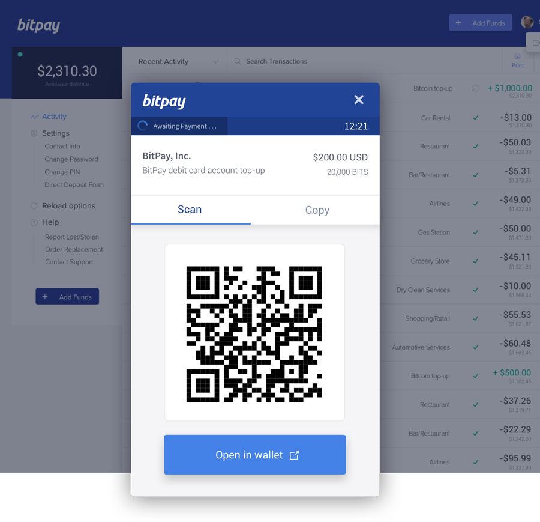

# bitpay-card
A `MEAN` full stack `JavaScript` + `TypeScript` single page app - `MongoDB` + `Express.js` + `Angular 2` + `Node.js`

## Live Demo
Hosted at https://bitpay-card.herokuapp.com/  
Email: `a@a.aa` Password: `a`  
Note: Being hosted free may cause a slow load if app needs to wake.

## Prompt and Goals of project
Recreate interactive dashboard of transactions using Angular 2 - based off screenshot:

## TODO
- [ ] User database/auth(jwt)  
- [ ] Transaction pagination, search, and filter
